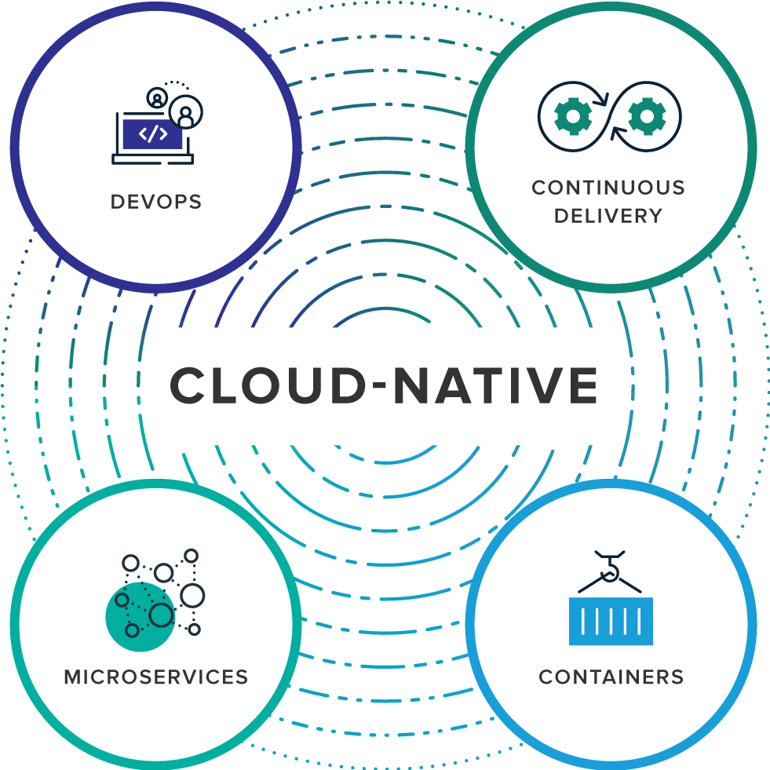

# 云原生（Cloud Native）的定义

Pivotal 是云原生应用的提出者，并推出了 Pivotal Cloud Foundry 云原生应用平台和 Spring 开源 Java 开发框架，成为云原生应用架构中先驱者和探路者。

## Pivotal最初的定义

早在2015年Pivotal公司的Matt Stine写了一本叫做
[迁移到云原生应用架构](https://jimmysong.io/migrating-to-cloud-native-application-architectures/)
的小册子，其中探讨了云原生应用架构的几个主要特征：

- 符合12因素应用
- 面向微服务架构
- 自服务敏捷架构
- 基于API的协作
- 抗脆弱性

## Pivotal官网的定义

Pivotal官网 https://pivotal.io/cn/cloud-native 最新的定义：

云原生是一种方法，用于构建和运行充分利用云计算模型优势的应用。

企业需要一个用于构建和运行云原生应用和服务的平台，来自动执行并集成 DevOps、持续交付、微服务和容器等概念。

- DevOps 是软件开发人员和 IT 运营之间的合作，目标是自动执行软件交付和基础架构更改流程。它创造了一种文化和环境，可在其中快速、频繁且更可靠地构建、测试和发布软件。

- 持续交付使得单个应用更改在准备就绪后即可发布，而不必等待与其他更改捆绑发布或等待维护窗口期等事件。持续交付让发布行为变得平淡可靠，因此企业可以以更低的风险频繁交付，并更快地获得最终用户的反馈，直到部署成为业务流程和企业竞争力必不可少的组成部分。

- 微服务是将应用作为小型服务集合进行开发的架构方法，其中每个服务都可实施业务功能，在自己的流程中运行并通过 HTTP API 进行通信。每个微服务都可以独立于应用中的其他服务进行部署、升级、扩展和重新启动，通常作为自动化系统的一部分运行，可以在不影响最终客户的情况下频繁更新正在使用中的应用。

- 与标准虚拟机相比，容器能同时提供效率和速度。单个操作系统实例使用操作系统 级的虚拟化，在一个或多个隔离容器之间进行动态划分，每个容器都具有唯一的可写文件系统和资源配额。创建和破坏容器的开销较低，再加上单个虚拟机中的高包装密度，使容器成为部署各个微服务的完美计算工具。

## RedHat官网的定义

RedHat官网 https://www.redhat.com/zh/topics/cloud-native-apps 给出了如下定义：

云原生应用是独立的小规模松散耦合服务的集合，旨在提供备受认可的业务价值，例如快速融合用户反馈以实现持续改进。简而言之，通过云原生应用开发，您可以加速构建新应用，优化现有应用并将这些应用全部组合在一起。其目标是以企业需要的速度满足应用用户的需求。

如何构建云原生应用？
- DevOps
- 微服务
- API
- 容器

## CNCF最初的定义

到了2015年Google主导成立了云原生计算基金会（CNCF），起初CNCF对云原生（Cloud Native）的定义包含以下三个方面：

- 应用容器化
- 面向微服务架构
- 应用支持容器的编排调度

到了2018年，随着近几年来云原生生态的不断壮大，所有主流云计算供应商都加入了该基金会，且从Cloud Native Landscape中可以看出云原生有意蚕食原先非云原生应用的部分。CNCF基金会中的会员以及容纳的项目越来越多，该定义已经限制了云原生生态的发展，CNCF为云原生进行了重新定位。

以下是CNCF对云原生的重新定义（中英对照）：

> Cloud native technologies empower organizations to build and run scalable applications in modern, dynamic environments such as public, private, and hybrid clouds. Containers, service meshes, microservices, immutable infrastructure, and declarative APIs exemplify this approach.

> 云原生技术有利于各组织在公有云、私有云和混合云等新型动态环境中，构建和运行可弹性扩展的应用。**云原生的代表技术包括容器、服务网格、微服务、不可变基础设施和声明式API。**

> These techniques enable loosely coupled systems that are resilient, manageable, and observable. Combined with robust automation, they allow engineers to make high-impact changes frequently and predictably with minimal toil.

> 这些技术能够构建容错性好、易于管理和便于观察的松耦合系统。结合可靠的自动化手段，云原生技术使工程师能够轻松地对系统作出频繁和可预测的重大变更。

> The Cloud Native Computing Foundation seeks to drive adoption of this paradigm by fostering and sustaining an ecosystem of open source, vendor-neutral projects. We democratize state-of-the-art patterns to make these innovations accessible for everyone.

> 云原生计算基金会（CNCF）致力于培育和维护一个厂商中立的开源生态系统，来推广云原生技术。我们通过将最前沿的模式民主化，让这些创新为大众所用。

CNCF定义地址：https://github.com/cncf/toc/blob/master/DEFINITION.md
