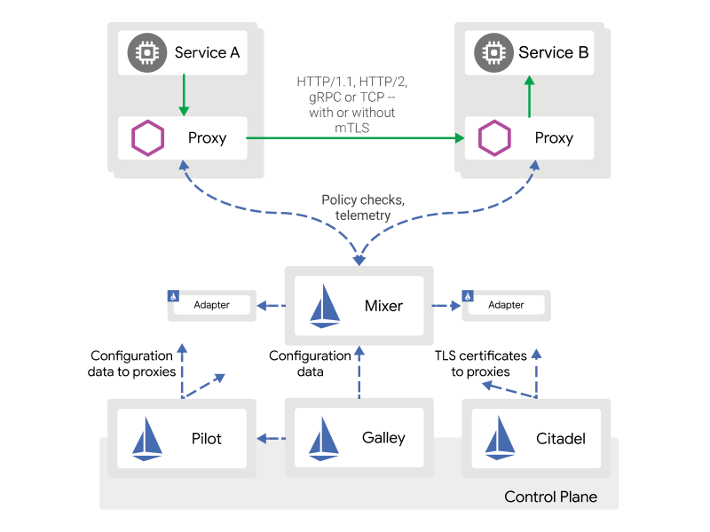

# Istio


## 什么是服务网格？

服务网格（Service Mesh）是致力于解决服务间通讯的基础设施层。它负责在现代云原生应用程序的复杂服务拓扑来可靠地传递请求。实际上，Service Mesh 通常是通过一组轻量级网络代理（Sidecar proxy），与应用程序代码部署在一起来实现，而无需感知应用程序本身。

服务网格（Service Mesh）这个术语通常用于描述构成这些应用程序的微服务网络以及应用之间的交互。随着规模和复杂性的增长，服务网格越来越难以理解和管理。它的需求包括服务发现、负载均衡、故障恢复、指标收集和监控以及通常更加复杂的运维需求，例如 A/B 测试、金丝雀发布、限流、访问控制和端到端认证等。


## 什么是Istio

Istio是Google/IBM/Lyft联合开发的开源Service Mesh项目。Istio用于连接、保护、控制和观测服务。

Istio 提供了一个完整的解决方案，通过为整个服务网格提供行为洞察和操作控制来满足微服务应用程序的多样化需求。

## 为什么要使用 Istio？

Istio 提供一种简单的方式来为已部署的服务建立网络，该网络具有负载均衡、服务间认证、监控等功能，只需要对服务的代码进行一点或不需要做任何改动。想要让服务支持 Istio，只需要在您的环境中部署一个特殊的 sidecar 代理，使用 Istio 控制平面功能配置和管理代理，拦截微服务之间的所有网络通信：

- HTTP、gRPC、WebSocket 和 TCP 流量的自动负载均衡。
- 通过丰富的路由规则、重试、故障转移和故障注入，可以对流量行为进行细粒度控制。
- 可插入的策略层和配置 API，支持访问控制、速率限制和配额。
- 对出入集群入口和出口中所有流量的自动度量指标、日志记录和追踪。
- 通过强大的基于身份的验证和授权，在集群中实现安全的服务间通信。

Istio 旨在实现可扩展性，满足各种部署需求。

## 架构

Istio 服务网格逻辑上分为**数据平面**和**控制平面**。

- **数据平面**由一组以 sidecar 方式部署的智能代理（Envoy）组成。这些代理可以调节和控制微服务及 Mixer 之间所有的网络通信。

- **控制平面**负责管理和配置代理来路由流量。此外控制平面配置 Mixer 以实施策略和收集遥测数据。

下图显示了构成每个面板的不同组件：


- **Envoy**：Istio 使用 Envoy 代理的扩展版本，Envoy 是以 C++ 开发的高性能代理，用于调解服务网格中所有服务的所有入站和出站流量。
- **Mixer**：Mixer 是一个独立于平台的组件，负责在服务网格上执行访问控制和使用策略，并从 Envoy 代理和其他服务收集遥测数据。
- **Pilot**：Pilot 为 Envoy sidecar 提供服务发现功能，为智能路由（例如 A/B 测试、金丝雀部署等）和弹性（超时、重试、熔断器等）提供流量管理功能。
- **Citadel**：Citadel 通过内置身份和凭证管理赋能强大的服务间和最终用户身份验证。
- **Galley**：Galley 代表其他的 Istio 控制平面组件，用来验证用户编写的 Istio API 配置。随着时间的推移，Galley 将接管 Istio 获取配置、 处理和分配组件的顶级责任。


## Istio Dashboard - Naftis

作为基础设施层，Istio有优秀的服务治理能力。但使用Istio进行服务治理时，开发者需通过istioctl或kubectl工具在终端中进行操作，这种方式目前存在一些问题，举例如下：
1. Istio要求用户熟练掌握istioctl工具的数百种指令，有较高的学习成本。
2. Istio进行服务治理时需要的yaml配置文件的数量非常庞大，如何配置和管理这些配置文件，也是个难题。
3. Istio的istioctl工具没有用户权限的约束，存在一定安全隐患，无法适应大公司严格的权限管理需求。
4. Istio的istioctl工具不支持任务回滚等需求，在执行任务出错的情况下，无法快速回滚到上一个正确版本。

为了解决这些问题，小米为Istio研发出了一套友好易用的Dashboard - Naftis。

> Naftis意为水手，和Istio（帆船）意境契合。作为dashboard，Naftis能使用户像水手一样熟练掌控和管理Istio。

GitHub地址：https://github.com/XiaoMi/naftis

> Naftis通过任务模板的方式来帮助用户更轻松地执行Istio任务。用户可以在 Naftis中定义自己的任务模板，并通过填充变量来构造单个或多个任务实例，从而完成各种服务治理功能。

Naftis提供了如下特性：

- 集成了一些常用的监控指标，包括40X、50X错误趋势等。
- 提供了可定制的任务模板的支持。
- 支持回滚指定某一任务。
- 提供了Istio状态诊断功能，可实时查看Istio的Services和Pod状态。
- 开箱即用，通过kubectl指令一键部署。

## Rancher + Istio

Rancher是一个开源的企业级Kubernetes管理平台，实现了Kubernetes集群在混合云+本地数据中心的集中部署与管理。

大量Rancher用户喜欢Rancher平台的原因，就是Rancher让管理和操作Kubernetes及相关的工具和技术变得极其简单，且用户们不必担心会被特定的云供应商锁定。而如今对于Istio，我们采取了同样的方法，致力于带给用户同样的体验。

- 在Rancher 2.3 Preview中，我们为用户提供了一个简单而友好的用户界面，在UI中使用工具菜单，即可启动Istio。系统提供了合理的默认配置，用户也可以根据需要进行修改。
- 为了监控流量，Istio需要注入Envoy sidecar。在Rancher 2.3 Preview当中，用户可以为每个空间名称注入自动sidecar。一旦您勾选了这个选项，Rancher会将sidecar容器注入到每个工作负载当中。
- Rancher简化了Istio的安装和配置，内置了一个支持Kiali的仪表盘，用于流量和遥测的可视化，然后用Jaeger进行追踪，甚至还有自己的Prometheus和Grafana（与用于高级监控的实例不同）。
- 在启用自动sidecar注入的命名空间中部署工作负载后，您可以跳转到Istio菜单目录，观察微服务应用程序的流量。
- 点击Kiali、Jaeger、Prometheus或者Grafana，您将进入每个工具相应的用户界面，您可以在其中找到详细信息和选项。


## 快速开始

### [在 Kubernetes 中快速开始](https://istio.io/zh/docs/setup/kubernetes/install/kubernetes/)

安装Istio，这里暂不需要安装应用

1. 使用 kubectl apply 安装 Istio 的自定义资源定义（CRD）

```
$ for i in install/kubernetes/helm/istio-init/files/crd*yaml; do kubectl apply -f $i; done
```

2. 宽容模式的 mutual TLS

```
$ kubectl apply -f install/kubernetes/istio-demo.yaml
```

3. 确认部署结果

```
# kubectl get svc -n istio-system
NAME                     TYPE           CLUSTER-IP      EXTERNAL-IP   PORT(S)                                                                                                                                      AGE
grafana                  ClusterIP      10.43.164.25    <none>        3000/TCP                                                                                                                                     23h
istio-citadel            ClusterIP      10.43.166.140   <none>        8060/TCP,15014/TCP                                                                                                                           23h
istio-egressgateway      ClusterIP      10.43.35.2      <none>        80/TCP,443/TCP,15443/TCP                                                                                                                     23h
istio-galley             ClusterIP      10.43.150.39    <none>        443/TCP,15014/TCP,9901/TCP                                                                                                                   23h
istio-ingressgateway     LoadBalancer   10.43.175.89    <pending>     15020:30043/TCP,80:31380/TCP,443:31390/TCP,31400:31400/TCP,15029:31100/TCP,15030:31902/TCP,15031:31185/TCP,15032:31038/TCP,15443:31712/TCP   23h
istio-pilot              ClusterIP      10.43.214.79    <none>        15010/TCP,15011/TCP,8080/TCP,15014/TCP                                                                                                       23h
istio-policy             ClusterIP      10.43.170.89    <none>        9091/TCP,15004/TCP,15014/TCP                                                                                                                 23h
istio-sidecar-injector   ClusterIP      10.43.118.128   <none>        443/TCP                                                                                                                                      23h
istio-telemetry          ClusterIP      10.43.26.28     <none>        9091/TCP,15004/TCP,15014/TCP,42422/TCP                                                                                                       23h
jaeger-agent             ClusterIP      None            <none>        5775/UDP,6831/UDP,6832/UDP                                                                                                                   23h
jaeger-collector         ClusterIP      10.43.109.9     <none>        14267/TCP,14268/TCP                                                                                                                          23h
jaeger-query             ClusterIP      10.43.25.193    <none>        16686/TCP                                                                                                                                    23h
kiali                    ClusterIP      10.43.128.208   <none>        20001/TCP                                                                                                                                    23h
prometheus               ClusterIP      10.43.7.172     <none>        9090/TCP                                                                                                                                     23h
tracing                  ClusterIP      10.43.97.15     <none>        80/TCP                                                                                                                                       23h
zipkin                   ClusterIP      10.43.156.148   <none>        9411/TCP                                                                                                                                     23h

# kubectl get pods -n istio-system
NAME                                      READY   STATUS      RESTARTS   AGE
grafana-97fb6966d-dk5wl                   1/1     Running     0          23h
istio-citadel-7c7c5f5c99-f2spz            1/1     Running     0          23h
istio-cleanup-secrets-1.2.2-9wzq8         0/1     Completed   0          23h
istio-egressgateway-f7b8cc667-rdjvq       1/1     Running     0          23h
istio-galley-585fc86678-8njpb             1/1     Running     0          23h
istio-grafana-post-install-1.2.2-pxwln    0/1     Completed   0          23h
istio-ingressgateway-cfbf989b7-78cgr      1/1     Running     0          23h
istio-pilot-68f587df5d-46rt6              2/2     Running     0          6h32m
istio-pilot-68f587df5d-mdp9j              2/2     Running     0          23h
istio-policy-76cbcc4774-xs2h6             2/2     Running     2          23h
istio-security-post-install-1.2.2-6gsff   0/1     Completed   0          23h
istio-sidecar-injector-97f9878bc-bmnp4    1/1     Running     0          23h
istio-telemetry-5f4575974c-z22td          2/2     Running     2          23h
istio-tracing-595796cf54-dplhk            1/1     Running     0          23h
kiali-55fcfc86cc-cc9rb                    1/1     Running     0          23h
prometheus-5679cb4dcd-trxl4               1/1     Running     0          23h

```

注意：我们的ingressgateway EXTERNAL-IP 是 <pending>。访问这个网关，只能通过服务的 NodePort 或者使用端口转发来进行访问。

### [Bookinfo 应用](https://istio.io/zh/docs/examples/bookinfo/)

安装Bookinfo应用。

使用浏览器访问 http://$GATEWAY_URL/productpage 因为没有EXTERNAL-IP所以使用NodePort，我的地址是http://[IP]:31380/productpage 如果刷新几次应用的页面，就会看到 productpage 页面中会随机展示 reviews 服务的不同版本的效果（红色、黑色的星形或者没有显示）。

可以尝试**应用缺省目标规则**

## 任务-流量管理

### [配置请求流量](https://istio.io/zh/docs/tasks/traffic-management/request-routing/)
此任务将说明如何将请求动态路由到多个版本的微服务。

### [故障注入](https://istio.io/zh/docs/tasks/traffic-management/fault-injection/)
此任务说明如何注入延迟并测试应用程序的弹性。

### [流量转移](https://istio.io/zh/docs/tasks/traffic-management/traffic-shifting/)
本任务将演示如何逐步将流量从一个版本的微服务迁移到另一个版本。例如，您可以将流量从旧版本迁移到新版本。

### [流量管理-控制 Ingress 流量](https://istio.io/zh/docs/tasks/traffic-management/ingress/)
此任务描述如何使用Istio网关配置Istio以在服务网格外部公开服务。
```
// 查看 Sidecar 的自动注入
kubectl get namespace -L istio-injection

```

## 任务-安全

### [HTTP 服务的访问控制](https://istio.io/zh/docs/tasks/security/authz-http/)
Istio 采用基于角色的访问控制方式，本文内容涵盖了为 HTTP 设置访问控制的各个环节。

测试失败日志显示
```
[2019-07-24 08:13:03.541][22][debug][rbac] [external/envoy/source/extensions/filters/http/rbac/rbac_filter.cc:70] checking request: remoteAddress: 10.42.1.8:35818, localAddress: 10.42.0.18:9080, ssl: none, headers: ':authority', '139.219.9.241:31380'
':path', '/productpage'
':method', 'GET'
'upgrade-insecure-requests', '1'
'user-agent', 'Mozilla/5.0 (Windows NT 10.0; Win64; x64) AppleWebKit/537.36 (KHTML, like Gecko) Chrome/75.0.3770.142 Safari/537.36'
'accept', 'text/html,application/xhtml+xml,application/xml;q=0.9,image/webp,image/apng,*/*;q=0.8,application/signed-exchange;v=b3'
'accept-encoding', 'gzip, deflate'
'accept-language', 'zh-CN,zh;q=0.9,en;q=0.8,zh-TW;q=0.7,da;q=0.6,is;q=0.5'
'x-forwarded-for', '10.42.0.0'
'x-forwarded-proto', 'http'
'x-request-id', '44ec4ca3-8959-9b7b-a23a-4597c955e4a7'
'x-istio-attributes', 'CkEKF2Rlc3RpbmF0aW9uLnNlcnZpY2UudWlkEiYSJGlzdGlvOi8vZGVmYXVsdC9zZXJ2aWNlcy9wcm9kdWN0cGFnZQpDChhkZXN0aW5hdGlvbi5zZXJ2aWNlLmhvc3QSJxIlcHJvZHVjdHBhZ2UuZGVmYXVsdC5zdmMuY2x1c3Rlci5sb2NhbAoqCh1kZXN0aW5hdGlvbi5zZXJ2aWNlLm5hbWVzcGFjZRIJEgdkZWZhdWx0CikKGGRlc3RpbmF0aW9uLnNlcnZpY2UubmFtZRINEgtwcm9kdWN0cGFnZQpOCgpzb3VyY2UudWlkEkASPmt1YmVybmV0ZXM6Ly9pc3Rpby1pbmdyZXNzZ2F0ZXdheS1jZmJmOTg5YjctNzhjZ3IuaXN0aW8tc3lzdGVt'
'x-b3-traceid', '29188100552e87bf9eb2b586e81379fd'
'x-b3-spanid', '9eb2b586e81379fd'
'x-b3-sampled', '1'
'content-length', '0'
'x-envoy-internal', 'true'
, dynamicMetadata: filter_metadata {
  key: "istio_authn"
  value {
  }
}

[2019-07-24 08:13:03.541][22][debug][rbac] [external/envoy/source/extensions/filters/http/rbac/rbac_filter.cc:114] enforced denied
@                                                                                                                                    ```

修改 ServiceRoleBinding
```
apiVersion: "rbac.istio.io/v1alpha1"
kind: ServiceRoleBinding
metadata:
  name: bind-service-viewer
  namespace: default
spec:
  subjects:
  - user: "*"
  - properties:
      source.namespace: "istio-system"
  - properties:
      source.namespace: "default"
  roleRef:
    kind: ServiceRole
    name: "service-viewer"
```
测试通过


## 任务-策略

### [启用策略检查](https://istio.io/zh/docs/tasks/policy-enforcement/enabling-policy/)
本任务讲解如何启用 Istio 策略检查功能。

## 下一步

Service Mesh还并在企业生产环境上落地，一方面需要强大的运维支持，且要求运维具有一定开发能力；另一方面需要成熟配套工具的完善，不能依赖命令与手动管理配置等。

之后我们保持对Istio、Naftis、Rancher技术的关注，待生态进一步成熟后试用。


## 参考

[Istio文档](https://istio.io/zh/)

[小米正式开源Istio管理面板Naftis](https://mp.weixin.qq.com/s/Y2YBs4ENFWQTf7hEmsdi6g)

[让Istio比你想象中简单，Rancher新版本宣布支持Istio](https://mp.weixin.qq.com/s/YvCK7A-SpjjWd2zYpGqvqA)
