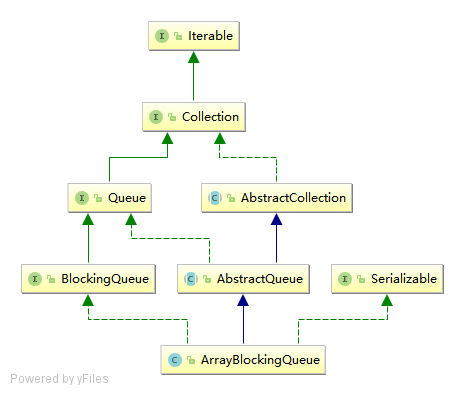

# 阅读模板

## 简单总结

1. 一个由数组支持的有界阻塞队列。此队列按 FIFO（先进先出）原则对元素进行排序。新元素插入到队列的尾部，队列获取操作则是从队列头部开始获得元素。
2. ArrayBlockingQueue的并发阻塞是通过ReentrantLock和Condition来实现的。
3. ArrayBlockingQueue内部只有一把锁，意味着同一时刻只有一个线程能进行入队或者出队的操作。

## 继承关系



### Queue 方法

 操作 | 抛出异常	 | 特殊值
---------- | ----------- | -----------
插入 | add(e) | offer(e)
移除	 | remove() | poll()
检查 | element()| peek()

Queue提供了插入、提取和检查操作。每个方法都存在两种形式：一种抛出异常（操作失败时），另一种返回一个特殊值（null 或 false，具体取决于操作）。插入操作的后一种形式是用于专门为有容量限制的 Queue 实现设计的

### BlockingQueue 方法

 操作 | 抛出异常	 | 特殊值 | 阻塞 | 超时
---------- | ----------- | ----------- | ----------- | -----------
插入 | add(e) | offer(e) | put(e) | offer(e, time, unit)
移除	 | remove() | poll() | take()| poll(time, unit)
检查 | element()| peek() | 不可用	 | 不可用

BlockingQueue 方法以四种形式出现，对于不能立即满足但可能在将来某一时刻可以满足的操作，这四种形式的处理方式不同：第一种是抛出一个异常，第二种是返回一个特殊值（null 或 false，具体取决于操作），第三种是在操作可以成功前，无限期地阻塞当前线程，第四种是在放弃前只在给定的最大时间限制内阻塞


## 源码分析

```java
public class ArrayBlockingQueue<E> extends AbstractQueue<E>
        implements BlockingQueue<E>, java.io.Serializable {
    
    final Object[] items;
    
    // 下一个take, poll, peek or remove的元素索引
    int takeIndex;
    
    // 下一个put, offer, or add的元素索引
    int putIndex;
    
    // 队列中的元素数量
    int count;
    
    // 并发控制使用经典的双条件算法
    
    /** Main lock guarding all access */
    final ReentrantLock lock;
    
    /** Condition for waiting takes */
    private final Condition notEmpty;
    
    /** Condition for waiting puts */
    private final Condition notFull;
    
    // 共用迭代器
    transient Itrs itrs = null;
    
    // 指定容量
    public ArrayBlockingQueue(int capacity) {
            this(capacity, false);
    }
    
    // 指定容量和ReentrantLock是否公平
     public ArrayBlockingQueue(int capacity, boolean fair) {
        if (capacity <= 0)
            throw new IllegalArgumentException();
        this.items = new Object[capacity];
        lock = new ReentrantLock(fair);
        notEmpty = lock.newCondition();
        notFull =  lock.newCondition();
    }
    
    // 包含给定集合的元素
    public ArrayBlockingQueue(int capacity, boolean fair,
                              Collection<? extends E> c) {
        this(capacity, fair);
        // ...
    }
    
    // 将指定的元素插入此队列的尾部，如果该队列已满，则等待可用的空间。
    public void put(E e) throws InterruptedException {
        // 检查元素是否为null，如果是，抛出NullPointerException
        checkNotNull(e);
        final ReentrantLock lock = this.lock;
        lock.lockInterruptibly();
        try {
            // 如果队列已满，阻塞，等待队列成为不满状态
            while (count == items.length)
                notFull.await();
            // 元素入队
            enqueue(e);
        } finally {
            lock.unlock();
        }
    }
    
    // enqueue方法用于元素入队，由于有元素进入队列，所有通知notEmpty的Condition，释放因队列为空阻塞的线程
    private void enqueue(E x) {
        // assert lock.getHoldCount() == 1;
        // assert items[putIndex] == null;
        final Object[] items = this.items;
        items[putIndex] = x;
        if (++putIndex == items.length)
            putIndex = 0;
        count++;
        notEmpty.signal();
    }
    
    //  获取并移除此队列的头部，在元素变得可用之前一直等待（如果有必要）。
    public E take() throws InterruptedException {
        final ReentrantLock lock = this.lock;
        lock.lockInterruptibly();
        try {
            // 如果队列为空，阻塞
            while (count == 0)
                notEmpty.await();
            // 元素出队
            return dequeue();
        } finally {
            lock.unlock();
        }
    }
    
    private E dequeue() {
        // assert lock.getHoldCount() == 1;
        // assert items[takeIndex] != null;
        final Object[] items = this.items;
        @SuppressWarnings("unchecked")
        E x = (E) items[takeIndex];
        items[takeIndex] = null;
        if (++takeIndex == items.length)
            takeIndex = 0;
        count--;
        if (itrs != null)
            itrs.elementDequeued();
        // 通知因队列满而阻塞的线程
        notFull.signal();
        return x;
    }
    
   
    
}
```
## ArrayBlockingQueue 阻塞过程
1. 如果队列已满，那么调用put时，因为调用了notFull.await()，那么那个线程将会放弃锁进入到阻塞状态，这时一个线程取走了一个数据，调用了notFull.signal()，这时上一个线程有可能就被释放了然后重新获得了锁，调用了enqueue()方法将元素插入到队列中；
2. 如果队列为空，执行take()，那么由于调用了notEmpty.await()，该线程将会被阻塞，这时另一个线程执行了put()方法插入了一个元素，然后调用了notEmpty.signal()，这时取走线程被释放了重新获取了锁取走了数据。
