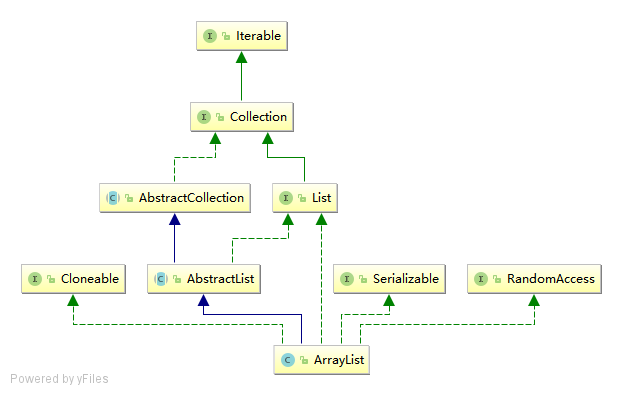

# ArrayList

## 简单总结

1. ArrayList 采用数组的数据结构，即 **Object[]**，每次扩容为1.5倍
2. ArrayList 随机访问元素的时间复杂度为O(n)，指定位置插入与删除元素，需要移动数组元素，效率较低
3. 遍历访问可使用for循环get获取元素和Iterator.hasNext next()获取元素
4. ArrayList每次修改（增加、删除）容器时，都是修改自身的modCount；在生成迭代器时，迭代器会保存该modCount值，迭代器每次获取元素时，会比较自身的modCount与ArrayList的modCount是否相等，来判断容器是否已经被修改，如果被修改了则抛出异常（fast-fail机制）。

## 继承关系



## 数据结构

```java

// 默认初始容量
private static final int DEFAULT_CAPACITY = 10;

// 空数组共享实例
private static final Object[] EMPTY_ELEMENTDATA = {};

// 缺省大小的空数组共享实例
private static final Object[] DEFAULTCAPACITY_EMPTY_ELEMENTDATA = {};

// 存储ArrayList元素的数组缓冲区
transient Object[] elementData;

// 大小
private int size;

// 最大可分配大小
private static final int MAX_ARRAY_SIZE = Integer.MAX_VALUE - 8;

```
