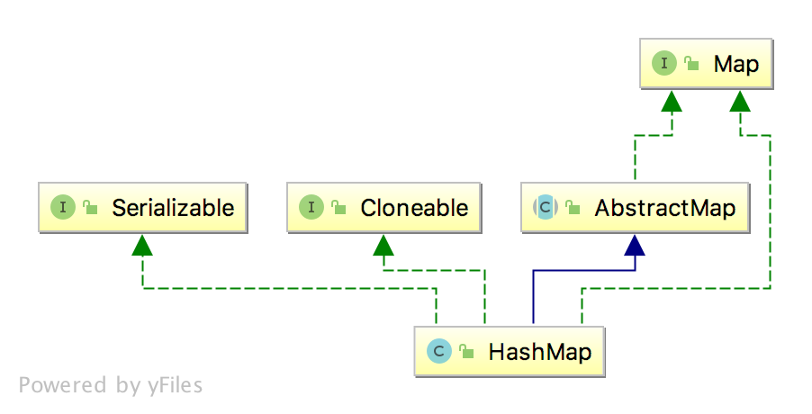

# HashMap

## 简单总结

底层是由数组+链表+红黑树来实现的。

1. 基于哈希表的Map接口实现。允许null values 和 the null key。
2. 迭代集合视图所需要的时间与HashMap实例的容量（"capacity" ，桶的数量）加上其大小（size，映射键值对的数量）成比例关系。因此，若迭代性能很重要，则不要将初始容量（initial capacity）设置过高（或者负载因子[load factor]设置过低）是非常重要的。
3. 一个HashMap的实例有两个影响其性能的参数：初始容量（initial capacity） 和负载因子（load factor）。
4. 通常，默认负载因子（0.75）在时间与空间成本之间提供了良好的权衡。较高的值会减少空间成本，但会增加查找成本（反映在HashMap类的大部分操作中，包含get和put）。
5. 如果很多映射关系需要存储在一个HashMap实例中，则相对于根据需要执行rehash操作扩展表的容量来说，使用足够大的初始容量创建它将使映射关系更有效地存储。
6. 由所有此类的“集合视图方法”返回的迭代器都是 fail-fast 的。
7. 该Map通常充当一个binned(bucketed)哈希表，但是当容器变得太大时，它们就会转成TreeNodes的bins，每个bins的结构都与java.util.TreeMap类型。大多数方法尝试使用普通bins，但在适用的情况下中继到TreeNode（简单的通过检测节点的实例）。
8. 该类是Java Collections Framework中的一员。

## 继承关系



## 数据结构

```java

// 默认初始容量 - 必须是2的幂
static final int DEFAULT_INITIAL_CAPACITY = 1 << 4;

// 最大容量 - 必须是2的幂 <= 1 << 30
static final int MAXIMUM_CAPACITY = 1 << 30;

// 默认加载因子
static final float DEFAULT_LOAD_FACTOR = 0.75f;

// 链表转化成树的桶数阈值
static final int TREEIFY_THRESHOLD = 8;

// 树转化成链表的桶数阈值
static final int UNTREEIFY_THRESHOLD = 6;

// 容器被树化的table最小容量
static final int MIN_TREEIFY_CAPACITY = 64;

// The table，长度始终是2的幂
transient Node<K,V>[] table;

// map中键值对的set集合
transient Set<Map.Entry<K,V>> entrySet;

// map中键值对的数量
transient int size;

// map结构修改次数，用于迭代器fail-fast，抛出ConcurrentModificationException
transient int modCount;

// 大于该阈值，则重新扩容 threshold = (capacity * load factor)
int threshold;

// 加载因子
final float loadFactor;

// 基础的哈希桶节点，用于大部分条目
static class Node<K,V> implements Map.Entry<K,V> {
    final int hash;
    final K key;
    V value;
    Node<K,V> next;

    Node(int hash, K key, V value, Node<K,V> next) {
        this.hash = hash;
        this.key = key;
        this.value = value;
        this.next = next;
    }

    public final K getKey()        { return key; }
    public final V getValue()      { return value; }
    public final String toString() { return key + "=" + value; }

    public final int hashCode() {
        return Objects.hashCode(key) ^ Objects.hashCode(value);
    }

    public final V setValue(V newValue) {
        V oldValue = value;
        value = newValue;
        return oldValue;
    }

    public final boolean equals(Object o) {
        if (o == this)
            return true;
        if (o instanceof Map.Entry) {
            Map.Entry<?,?> e = (Map.Entry<?,?>)o;
            if (Objects.equals(key, e.getKey()) &&
                Objects.equals(value, e.getValue()))
                return true;
        }
        return false;
    }
}

```
