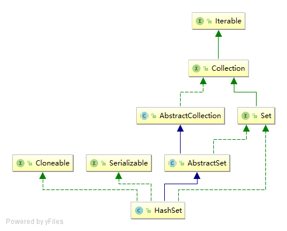

# HashSet

## 简单总结

1. HashSet 是一个没有重复元素的集合。

2. 底层是由HashMap实现的，不保证元素的顺序，而且HashSet允许使用 null 元素。

3. HashSet是非同步的。

## 继承关系



## 源码阅读

```java
public class HashSet<E>
    extends AbstractSet<E>
    implements Set<E>, Cloneable, java.io.Serializable
{
    // 底层使用HashMap存储数据
    private transient HashMap<E,Object> map;
    
    // HashMap中所有Key的Value值
    private static final Object PRESENT = new Object();
    
    // 添加元素
    public boolean add(E e) {
        return map.put(e, PRESENT)==null;
    }
    
    // 移除元素
    public boolean remove(Object o) {
        return map.remove(o)==PRESENT;
    }
    
    // 返回此集合中元素的迭代器。 元素以无特定顺序返回
    public Iterator<E> iterator() {
        return map.keySet().iterator();
    }
}

```