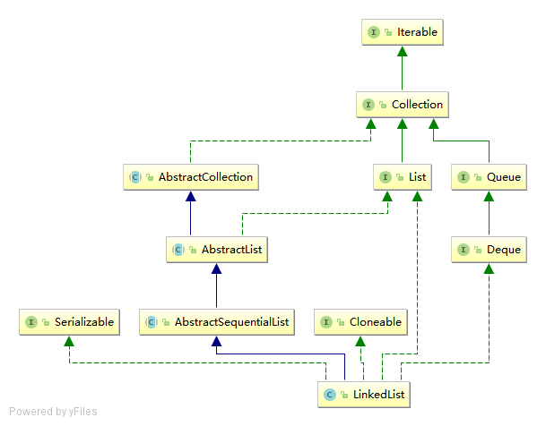

# LinkedList

## 简单总结

1. LinkedList 采用双向链表的数据结构，使用的Node内部类，包含item元素本身、next下一个节点、prev上一个节点。
2. LinkedList 增加、删除操作时间复杂度为O(1)，查找时间复杂度为O(n)，查找函数有一定优化，容器会先判断查找的元素是离头部较近，还是尾部较近，来决定从头部开始遍历还是尾部开始遍历
3. LinkedList 实现了Deque接口，因此也可以作为栈、队列和双端队列来使用

## 继承关系



## 数据结构

```java

// 元素个数
transient int size = 0;
// 链表的头节点
transient Node<E> first;
// 链表的尾节点
transient Node<E> last;

// Node 静态内部类
private static class Node<E> {
    // 元素本身
    E item;
    // 前一个节点
    Node<E> next;
    // 后一个节点
    Node<E> prev;

    Node(Node<E> prev, E element, Node<E> next) {
        this.item = element;
        this.next = next;
        this.prev = prev;
    }
}

```
