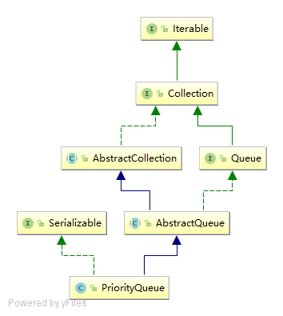

# PriorityQueue

## 简单总结
1. 一个基于优先级堆的无界优先级队列。优先级队列的元素按照其自然顺序进行排序，或者根据构造队列时提供的 Comparator 进行排序，具体取决于所使用的构造方法。优先级队列不允许使用 null 元素。依靠自然顺序的优先级队列还不允许插入不可比较的对象（这样做可能导致 ClassCastException）。
2. 此队列的头 是按指定排序方式确定的最小元素。如果多个元素都是最小值，则头是其中一个元素——选择方法是任意的。队列获取操作 poll、remove、peek 和 element 访问处于队列头的元素。
4. 此实现不是同步的。如果多个线程中的任意线程修改了队列，则这些线程不应同时访问 PriorityQueue 实例。相反，请使用线程安全的 PriorityBlockingQueue 类。
3. 此实现为排队和出队方法（offer、poll、remove() 和 add）提供 O(log(n)) 时间；为 remove(Object) 和 contains(Object) 方法提供线性时间；为获取方法（peek、element 和 size）提供固定时间。
## 继承关系



## 数据结构
PriorityQueue通过二叉小顶堆实现，可以用一棵完全二叉树表示。

[了解二叉堆](https://blog.csdn.net/u010224394/article/details/8834969)

PriorityQueue是一种满足某些条件的完全二叉树.

所谓的"完全二叉树", 要满足:
- 除了最后一层, 所有层都排满(没有非空节点)
- 最后一层的所有非空节点都排在左边

一个完全二叉树能被成为PriorityQueue的话, 要满足的条件就是:
- 对于任何一个节点, 它的优先级都大于左右子节点的优先级.

## 源码阅读

- offer(E e)的实现思路：
    - 检查是否为空
    - 判断数组是否已满，满了进行扩容
    - 将元素加入到queue[size-1]，如果不是第一个元素，向上升来保持二叉堆的特性。

- poll()的实现思路：
    - 检查是否为空，为空返回null
    - 取出queue[0]元素，然后将queue[size-1]插入到queue[0]，然后向下沉来保持二叉堆的特性。

```java
public class PriorityQueue<E> extends AbstractQueue<E>
    implements java.io.Serializable {
    
    // 默认初始化容量
    private static final int DEFAULT_INITIAL_CAPACITY = 11;

    /**
     * Priority queue represented as a balanced binary heap: the two
     * children of queue[n] are queue[2*n+1] and queue[2*(n+1)].  The
     * priority queue is ordered by comparator, or by the elements'
     * natural ordering, if comparator is null: For each node n in the
     * heap and each descendant d of n, n <= d.  The element with the
     * lowest value is in queue[0], assuming the queue is nonempty.
     */
    transient Object[] queue;

    // 优先级队列中的元素数量
    private int size = 0;

    // 比较器
    private final Comparator<? super E> comparator;
   
    // 优先级队列结构修改次数
    transient int modCount = 0;
    
    public boolean add(E e) {
        return offer(e);
    }
    
    // 元素入队
    public boolean offer(E e) {
        if (e == null)
            throw new NullPointerException();
        modCount++;
        int i = size;
        // 扩容
        if (i >= queue.length)
            grow(i + 1);
        size = i + 1;
        if (i == 0)
            queue[0] = e;
        else
            siftUp(i, e);
        return true;
    }

    // 在位置k处插入x，通过上升x直到它大于或等于其父节点或者x是根来保持二叉堆的特性。
    private void siftUp(int k, E x) {
        if (comparator != null)
            siftUpUsingComparator(k, x);
        else
            siftUpComparable(k, x);
    }
    
    @SuppressWarnings("unchecked")
    private void siftUpComparable(int k, E x) {
        Comparable<? super E> key = (Comparable<? super E>) x;
        while (k > 0) {
            int parent = (k - 1) >>> 1;
            Object e = queue[parent];
            if (key.compareTo((E) e) >= 0)
                break;
            queue[k] = e;
            k = parent;
        }
        queue[k] = key;
    }

    @SuppressWarnings("unchecked")
    private void siftUpUsingComparator(int k, E x) {
        while (k > 0) {
            // 父节点
            int parent = (k - 1) >>> 1;
            Object e = queue[parent];
            // x大于等于k的父节点，赋值x给queue[k]
            if (comparator.compare(x, (E) e) >= 0)
                break;
            // 父节点下降，x上升，
            queue[k] = e;
            k = parent;
        }
        queue[k] = x;
    }
    
    // 元素出队
    @SuppressWarnings("unchecked")
    public E poll() {
        if (size == 0)
            return null;
        int s = --size;
        modCount++;
        E result = (E) queue[0];
        E x = (E) queue[s];
        queue[s] = null;
        if (s != 0)
            siftDown(0, x);
        return result;
    }
    
    // 在位置k处插入x，通过将x下沉直到它小于或等于其子节点或者x是叶子来保持二叉堆的特性。
    private void siftDown(int k, E x) {
        if (comparator != null)
            siftDownUsingComparator(k, x);
        else
            siftDownComparable(k, x);
    }
    
    @SuppressWarnings("unchecked")
    private void siftDownComparable(int k, E x) {
        Comparable<? super E> key = (Comparable<? super E>)x;
        int half = size >>> 1;        // loop while a non-leaf
        while (k < half) {
            int child = (k << 1) + 1; // assume left child is least
            Object c = queue[child];
            int right = child + 1;
            if (right < size &&
                ((Comparable<? super E>) c).compareTo((E) queue[right]) > 0)
                c = queue[child = right];
            if (key.compareTo((E) c) <= 0)
                break;
            queue[k] = c;
            k = child;
        }
        queue[k] = key;
    }
    
    @SuppressWarnings("unchecked")
    private void siftDownUsingComparator(int k, E x) {
        int half = size >>> 1;
        while (k < half) {
            // k的左子节点
            int child = (k << 1) + 1;
            Object c = queue[child];
            // k的右子节点
            int right = child + 1;
            // 判断right存在，同时选择较小的子节点
            if (right < size &&
                comparator.compare((E) c, (E) queue[right]) > 0)
                c = queue[child = right];
            // x小于等于k的子节点时，赋值x给queue[k]
            if (comparator.compare(x, (E) c) <= 0)
                break;
            // 子节点上升，x下沉
            queue[k] = c;
            k = child;
        }
        queue[k] = x;
    }
}
```