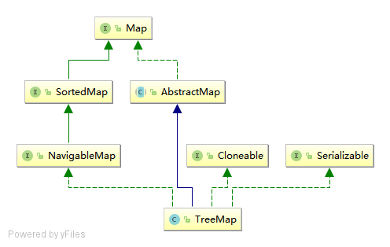

# TreeMap

## 简单总结


## 继承关系



## 数据结构
TreeMap 内部实现是红黑树

### 红黑树性质
红黑树是每个节点都带有颜色属性的二叉查找树，颜色为红色或黑色。在二叉查找树强制一般要求以外，对于任何有效的红黑树我们增加了如下的额外要求：

1. 节点是红色或黑色。
2. 根是黑色。
3. 所有叶子都是黑色（叶子是NIL节点）。
4. 每个红色节点必须有两个黑色的子节点。（从每个叶子到根的所有路径上不能有两个连续的红色节点。）
5. 从任一节点到其每个叶子的所有简单路径都包含相同数目的黑色节点。

红黑树的图例：


### 二叉查找树性质
二叉查找树（英语：Binary Search Tree），也称为二叉搜索树、有序二叉树（ordered binary tree）或排序二叉树（sorted binary tree），是指一棵空树或者具有下列性质的二叉树：

1. 若任意节点的左子树不空，则左子树上所有节点的值均小于它的根节点的值；
2. 若任意节点的右子树不空，则右子树上所有节点的值均大于它的根节点的值；
3. 任意节点的左、右子树也分别为二叉查找树；
4. 没有键值相等的节点。

二叉查找树相比于其他数据结构的优势在于查找、插入的时间复杂度较低。为O(log n)。

### 二叉树
二叉树（英语：Binary tree）是每个节点最多只有两个分支（即不存在分支度大于2的节点）的树结构。

## 源码阅读

```java
public class TreeMap<K,V>
    extends AbstractMap<K,V>
    implements NavigableMap<K,V>, Cloneable, java.io.Serializable
{
    private final Comparator<? super K> comparator;
    private transient Entry<K,V> root;
    private transient int size = 0;
    private transient int modCount = 0;
    
    private transient EntrySet entrySet;
    private transient KeySet<K> navigableKeySet;
    private transient NavigableMap<K,V> descendingMap;
    
    private static final boolean RED   = false;
    private static final boolean BLACK = true;
    
    public V put(K key, V value) {
        Entry<K,V> t = root;
        // 根节点为空
        if (t == null) {
            // 类型检查
            compare(key, key); 
            root = new Entry<>(key, value, null);
            size = 1;
            modCount++;
            return null;
        }
        int cmp;
        Entry<K,V> parent;
        // 分离 comparator 和 comparable 比较器
        Comparator<? super K> cpr = comparator;
        if (cpr != null) {
            // 循环查找key，如果找到则替换value，没有则记录其parent，后面进行插入
            do {
                parent = t;
                cmp = cpr.compare(key, t.key);
                if (cmp < 0)
                    t = t.left;
                else if (cmp > 0)
                    t = t.right;
                else
                    return t.setValue(value);
            } while (t != null);
        }
        else {
            if (key == null)
                throw new NullPointerException();
            @SuppressWarnings("unchecked")
            Comparable<? super K> k = (Comparable<? super K>) key;
            // 循环查找key，如果找到则替换value，没有则记录其parent，后面进行插入
            do {
                parent = t;
                cmp = k.compareTo(t.key);
                if (cmp < 0)
                    t = t.left;
                else if (cmp > 0)
                    t = t.right;
                else
                    return t.setValue(value);
            } while (t != null);
        }
        // 创建结点，然后比较与parent的大小，小放在左结点，大放在右节点
        Entry<K,V> e = new Entry<>(key, value, parent);
        if (cmp < 0)
            parent.left = e;
        else
            parent.right = e;
        fixAfterInsertion(e);
        size++;
        modCount++;
        return null;
    }
    
    private void fixAfterInsertion(Entry<K,V> x) {
        // 约定插入的节点是红节点
        x.color = RED;
        // x本身红色，如果其父节点也是红色，违反规则4，进行循环处理
        while (x != null && x != root && x.parent.color == RED) {
            // 父节点是左节点
            if (parentOf(x) == leftOf(parentOf(parentOf(x)))) {
                // 获取父节点的右兄弟y
                Entry<K,V> y = rightOf(parentOf(parentOf(x)));
                // p为左节点红色 y为右节点红色
                if (colorOf(y) == RED) {
                    setColor(parentOf(x), BLACK);
                    setColor(y, BLACK);
                    setColor(parentOf(parentOf(x)), RED);
                    x = parentOf(parentOf(x));
                } else {
                    // p为左节点红色 y为右节点黑色 x为右节点红色 左旋
                    if (x == rightOf(parentOf(x))) {
                        x = parentOf(x);
                        rotateLeft(x);
                    }
                    // p为左节点红色 y为右节点黑色 x为左节点红色 右旋转
                    setColor(parentOf(x), BLACK);
                    setColor(parentOf(parentOf(x)), RED);
                    rotateRight(parentOf(parentOf(x)));
                }
                // 父节点是右节点
            } else {
                Entry<K,V> y = leftOf(parentOf(parentOf(x)));
                if (colorOf(y) == RED) {
                    setColor(parentOf(x), BLACK);
                    setColor(y, BLACK);
                    setColor(parentOf(parentOf(x)), RED);
                    x = parentOf(parentOf(x));
                } else {
                    if (x == leftOf(parentOf(x))) {
                        x = parentOf(x);
                        rotateRight(x);
                    }
                    setColor(parentOf(x), BLACK);
                    setColor(parentOf(parentOf(x)), RED);
                    rotateLeft(parentOf(parentOf(x)));
                }
            }
        }
        root.color = BLACK;
    }
}

```
